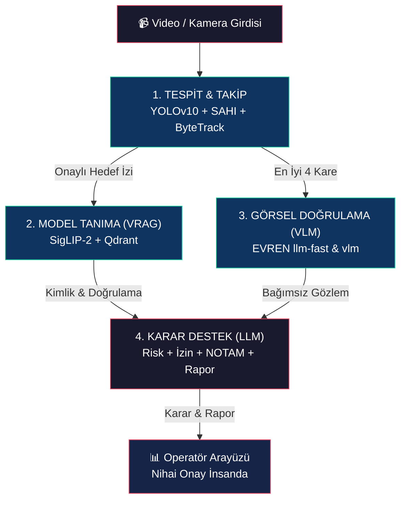

#  YZT-MEVZUU

### Gerçek Zamanlı Hava Sahası Gözetleme, İHA/Uçak Tanıma ve Operasyonel Karar Destek Sistemi


---

Canlı kamera veya video akışından hava araçlarını **tespit eden**, model kimliğini **belirleyen**, görsel doğrulama ile **çapraz onaylayan** ve elde edilen bulguları deterministik kurallar + LLM ile **operasyonel karar desteğine** dönüştüren uçtan uca yerli yapay zekâ sistemi.

<br>

[Proje Vizyonu](#-proje-vizyonu) · [Sistem Mimarisi](#%EF%B8%8F-sistem-mimarisi) · [Teknoloji Yığını](#-teknoloji-yığını) · [Veri Seti & RAG](#-veri-seti--rag-altyapısı) · [Kurulum](#-kurulum-ve-çalıştırma) · [Demo & Arayüz](#%EF%B8%8F-demo-ve-operatör-arayüzü) · [Ekip](#-ekibimiz)

</div>

---

## 📋 İçindekiler

- [🎯 Proje Vizyonu](#-proje-vizyonu)
- [🏗️ Sistem Mimarisi](#%EF%B8%8F-sistem-mimarisi)
  - [Katman 1 — Tespit & Takip](#katman-1--tespit--takip-edge--gpu)
  - [Katman 2 — Visual RAG](#katman-2--görsel-tanıma-visual-rag)
  - [Katman 3 — Görsel Doğrulama (VLM)](#katman-3--görsel-doğrulama-vlm)
  - [Katman 4 — Operasyonel Karar Destek (LLM)](#katman-4--operasyonel-karar-destek-llm)
- [⚙️ Teknoloji Yığını](#-teknoloji-yığını)
- [🗃️ Veri Seti & RAG Altyapısı](#-veri-seti--rag-altyapısı)
- [📂 Proje Dizin Yapısı](#-proje-dizin-yapısı)
- [🚀 Kurulum ve Çalıştırma](#-kurulum-ve-çalıştırma)
- [🖥️ Demo ve Operatör Arayüzü](#%EF%B8%8F-demo-ve-operatör-arayüzü)
- [🧪 Test ve Doğrulama](#-test-ve-doğrulama)
- [🔮 Gelecek Hedeflerimiz](#-gelecek-hedeflerimiz)
- [👥 Ekibimiz](#-ekibimiz)

---

## 🎯 Proje Vizyonu

Günümüzde hava sahası güvenliği yalnızca "havada bir şey var" tespitinden çok daha fazlasını gerektirmektedir. Tespit edilen platformun **kim olduğunu**, **tehdit seviyesini** ve **ne yapılması gerektiğini** açıklanabilir şekilde ortaya koymak kritik bir ihtiyaçtır. **YZT-MEVZUU**, bu ihtiyacı aşağıdaki tasarım ilkeleriyle karşılar:

| İlke | Açıklama |
|:---|:---|
| 👁️ **Operatörü Kritik Ana Odaklama** | Saatlerce süren video akışı yerine yalnızca karar gerektiren kritik anlar sunulur. Dikkat dağınıklığı azalır, tepki süresi kısalır. |
| 📸 **Tek Kameradan Çok Katmanlı Anlam** | Aynı görüntü; tespit, takip, model tanıma, görsel doğrulama ve tehdit değerlendirmesi için birlikte kullanılır. |
| ⚖️ **Çapraz Doğrulama Mimarisi** | Kimlik ve tehdit değerlendirmesi tek bir modele bırakılmaz. YOLO → VRAG → VLM → LLM zinciri birbirini doğrular. |
| 🧠 **Karar Değil, Gerekçe Sunma** | Operatör yalnızca risk seviyesi görmez; riskin **nedenini**, kullanılan **kanıtları** (NOTAM, uçuş planı, envanter) ve önerilen **aksiyonu** birlikte görür. |
| ⚡ **Sahada Bağımsız Algı** | Tespit, takip ve model tanıma (VRAG) tamamen yerelde (Edge) çalışır. Bulut bağımlılığı yalnızca görsel doğrulama ve karar raporlamasında vardır. |
| 🛡️ **Anti-Halüsinasyon Koruması** | `OutputGuard` mekanizması ile risk kodu, karar enumu ve doğrulama bayrakları deterministik kurallarla korunur; LLM yalnızca Türkçe açıklama ve gerekçe üretir. |
| 👤 **Son Söz İnsanda** | Sistem otonom müdahale üretmez. Nihai aksiyon yetkisi her zaman operatördedir. |

---

## 🏗️ Sistem Mimarisi

Sistemimiz uçtan uca birbirini destekleyen **4 ana yapay zekâ katmanı** ve bir **operatör arayüzünden** oluşmaktadır:



---

### Katman 1 — Tespit & Takip (Edge / GPU)

Canlı video akışından hava araçlarını gerçek zamanlı olarak tespit edip çerçeve bazında izler.

| Bileşen | Detay |
|:---|:---|
| **Nesne Tespiti** | Özel eğitimli **YOLOv10** modeli (`models/best.pt`), GPU FP16 çıkarım desteği |
| **Akıllı Dilimleme (SAHI)** | 3 geçişli `SmartSlicer`: Pass-1 hızlı düşük çözünürlük ön tarama → Pass-2 640×640 yüksek çözünürlük SAHI dilimlemesi (%25 örtüşme) → Fallback tam kare tarama |
| **Varyans Ön-Filtresi** | Boş gökyüzü patçalarını YOLO'ya göndermeden eleyerek gereksiz hesaplamayı önler |
| **Çoklu Hedef Takibi** | **ByteTrack** + uyarlamalı **Kalman filtresi** ile sürekli iz takibi |
| **Kamera Hareketi Telafisi** | Farneback optik akış ile ego-motion kompanzasyonu (CMC), pan/tilt kameralarda titreme önleme |
| **Sahte Pozitif Filtreleme** | Geometrik filtreler, hız filtresi, ekran lekesi (HUD/watermark) filtresi, Otsu katı gövde doğrulaması, sınıf oylama mekanizması |
| **Performans** | GPU'da **30+ FPS**, uyarlamalı kare atlama ile sabit gecikme garantisi |

**Sınıflar:** `0: kite (uçurtma)` · `1: bird (kuş)` · `2: class_3 (uçak/İHA/drone)`

---

### Katman 2 — Görsel Tanıma (Visual RAG)

Tespit edilen hedefin **hangi model** olduğunu, klasik sınıflandırıcı yerine **retrieval tabanlı** görsel arama ile belirler. Yeni model eklemek için yeniden eğitim gerekmez — referans fotoğraf ekleyip indeksleme yeterlidir.

| Bileşen | Detay |
|:---|:---|
| **Görsel Gömücü** | **Google SigLIP-2** (`siglip2-so400m-patch14-384`) — 1152 boyutlu L2-normalize vektörler |
| **Vektör Veritabanı** | Yerel gömülü **Qdrant** üzerinde Cosine benzerlik araması |
| **Referans Veri Seti** | **95 hava aracı modeli**, ~2.809 referans görsel → veri artırma ile **16.854 vektör** |
| **Görüntü İyileştirme** | CLAHE + Unsharp Masking + Gamma düzeltme ile uzak/bulanık hedeflerde kontrast artırma |
| **Güven Mekanizması** | Top-1 vs Top-2 **margin kapısı** (eşik=0.015) — yanlış tahminlerin %86'sını yakalar |
| **Zamansal Oylama** | Son 15 aramanın çoğunluk oyu + histerezis ile kararlı model geçişi |
| **Best-Moment Tetikleme** | Laplacian varyansı (IQA) ile yalnızca en net karelerde arama tetiklenir |

---

### Katman 3 — Görsel Doğrulama (VLM)

VRAG'ın belirlediği kimliği **bağımsız bir görsel-dil modeli** ile çapraz doğrular.

| Bileşen | Detay |
|:---|:---|
| **Model** | **EVREN `llm-fast`** ve **`vlm`** (SSB TEKNOFEST çıkarım servisi, OpenAI uyumlu) |
| **Görüntü Kolajı** | Track'ten IQA skoruna göre seçilen en iyi **4 kare** → 2×2 grid kolaj |
| **Video Kanıtı** | Kısa video klibi ayrıca bağımsız değerlendirilir (kimlik kararını doğrular, değiştirmez) |
| **Yapılandırılmış Çıktı** | Strict JSON: hedef sınıfı (`sabit_kanat`, `doner_kanat`, `kus`), tehdit seviyesi, menşe ülkesi, model hipotezi, görsel açıklama |
| **Asenkron Çalışma** | Semaphore kontrollü thread havuzu — VLM çağrıları canlı video akışını **asla bloklamaz** |

---

### Katman 4 — Operasyonel Karar Destek (LLM)

Tespit ve tanıma sonuçlarını operasyonel bağlamla birleştirerek **açıklanabilir karar raporu** üretir.

| Bileşen | Detay |
|:---|:---|
| **Karar Motoru** | `FastAPI` tabanlı bağımsız mikroservis (`karar_servisi/`, Port 8001) |
| **Platform Kaydı** | **97 kanonik hava platformu**, **489 takma ad/alias**, otomatik eşleştirme |
| **Türkiye Envanteri** | 22 demo platform ile TSK envanter kontrolü |
| **Operasyonel Bağlam** | İzin durumu, uçuş planı, NOTAM çakışması, mevzuat uyumluluğu değerlendirmesi |
| **Text RAG** | DHMİ Türkiye AIP + SHGM SHT-İHA dokümanları, `bge-m3` ile vektörleştirilmiş |
| **OutputGuard** | Deterministik kural motoru — risk kodu, karar enumu ve doğrulama bayrakları LLM'den bağımsız hesaplanır |
| **LLM Rapor Üretimi** | EVREN `llm-fast` ile Türkçe doğal dil açıklama ve gerekçe sentezi |
| **Olay Belleği** | SQLite + aiosqlite ile kalıcı olay kaydı ve geçmiş sorgulaması |
| **Test Senaryoları** | 23 kabul senaryosu (SCN-01 — SCN-23) ile uçtan uca doğrulama |

<details>
<summary><b>🔐 OutputGuard Koruması — Detaylar</b></summary>

LLM halüsinasyonlarına karşı kritik alanlar deterministik olarak korunur:

```
LLM Çıktısı ──────► OutputGuard ──────► Son Karar
                        │
                        ├─ Risk Kodu: Deterministik kural motoru
                        ├─ Karar Enumu: İzin/NOTAM/envanter kontrolü  
                        ├─ Doğrulama Bayrakları: VRAG-VLM tutarlılık
                        └─ Türkçe Açıklama: LLM'den (serbest metin)
```

Bu mimari sayesinde LLM'in yaratıcı hataları **kritik karar alanlarını etkileyemez**.

</details>

---

## ⚙️ Teknoloji Yığını

| Alan | Teknoloji | Kullanım |
|:---|:---|:---|
| **Dil & Çalışma Ortamı** | Python 3.11, TypeScript 5.x | Backend/Pipeline + Frontend |
| **Nesne Tespiti** | Ultralytics YOLOv10 + SAHI | Özel eğitimli model, 3 geçişli dilimli tarama |
| **Çoklu Hedef Takibi** | ByteTrack + BoxMOT + Kalman | Uyarlamalı filtre, ego-motion kompanzasyonu |
| **Görsel Gömme** | Google SigLIP-2 (so400m-patch14-384) | 1152-D vektör, L2-normalize, Cosine benzerlik |
| **Vektör Veritabanı** | Qdrant (yerel gömülü + bulut) | Visual RAG + Text RAG depolama ve arama |
| **VLM Çıkarım** | EVREN `llm-fast` & `vlm` | Görsel doğrulama, video analizi |
| **LLM Çıkarım** | EVREN `llm-fast` (vLLM) | Karar raporu, Türkçe açıklama sentezi |
| **Text Gömme** | `bge-m3-embed` / `qwen3-embedding-0.6b` | Mevzuat dokümanları vektörleştirme |
| **Backend** | FastAPI + Uvicorn + WebSocket | MJPEG akış, REST API, asenkron iletişim |
| **Frontend** | React 18 + Vite + Tailwind CSS | Taktik operatör konsolu (SPA) |
| **Konteynerleştirme** | Docker + Docker Compose | CPU ve NVIDIA GPU dağıtım profilleri |
| **Paket Yönetimi** | uv (Astral) + Hatchling | Hızlı ve güvenilir Python bağımlılık yönetimi |
| **Görüntü İşleme** | OpenCV (CLAHE, Farneback OF, Otsu) | Kontrast artırma, hareket telafisi, gövde doğrulama |
| **Test** | Vitest + Playwright + pytest | Birim, entegrasyon ve E2E testleri |

---

## 🗃️ Veri Seti & RAG Altyapısı

Sistem, yapay zekâ halüsinasyonlarını engellemek ve **doğrulanabilir referans** sağlamak için kendi vektör veritabanlarına dayanır.

### 📸 Visual RAG — Referans Hava Aracı Veri Seti

<table>
<tr>
<td width="50%">

| Özellik | Değer |
|:---|:---|
| **Toplam Model** | 95 hava aracı |
| **Ham Görsel** | ~2.809 referans fotoğraf |
| **Artırılmış Vektör** | 16.854 (augmentation sonrası) |
| **Gömme Boyutu** | 1.152 boyut (SigLIP-2) |
| **Benzerlik Metriği** | Cosine Similarity |

</td>
<td width="50%">

**Veri Artırma Teknikleri:**
- 🔄 Döndürme (±12°)
- 🔍 Ölçekleme (×0.8, ×0.5, ×0.25)
- 🌫️ Gauss bulanıklık (σ=1.2)
- 📐 Perspektif eğim distorsiyonu

**Yeni Model Ekleme:** Sadece `data/referans/<kategori>/<model>/` klasörüne fotoğraf atıp `python -m src.vrag.ingest --img_dir data/referans` çalıştırmak yeterli.

</td>
</tr>
</table>

**Kategoriler:**

| # | Kategori | Örnek Modeller |
|:---:|:---|:---|
| 1 | 🇹🇷 Türkiye İHA/SİHA/TİHA/UCAV | TB2, TB3, AKINCI, ANKA, AKSUNGUR, KARGU |
| 2 | 🇹🇷 Türkiye Savaş Uçakları | F-16, F-4E 2020, HÜRKUŞ, KAAN, NF-5, T-38 |
| 3 | 🌍 Yabancı Savaş Uçakları | F-35, F-22, Su-57, Eurofighter, Rafale, J-20 |
| 4 | ✈️ Askeri Nakliye & Özel Görev | A400M, C-130, CN-235, E-7 Barış Kartalı |
| 5 | 🛩️ Sivil Yolcu Uçakları | Boeing 737/747/777/787, Airbus A320/A350/A380 |
| 6 | 🚁 Döner Kanatlılar | T129 ATAK, GÖKBEY, S-70, AH-64, Mi-24 |
| 7 | 🌐 Yabancı İHA/SİHA | MQ-9 Reaper, RQ-4 Global Hawk, Shahed-136 |
| 8 | 💣 Bombardıman & Stratejik | B-2 Spirit, B-52 Stratofortress |

---

### 📜 Text RAG — Mevzuat ve Operasyonel Dokümanlar

| Kaynak | İçerik | Kullanım |
|:---|:---|:---|
| **DHMİ Türkiye AIP** | Hava sahası sınıflandırması, kontrol bölgeleri | NOTAM ve izin değerlendirmesi |
| **SHGM SHT-İHA** | İnsansız hava aracı yönetmeliği, tescil esasları | Mevzuat uyumluluk kontrolü |

Metinler `bge-m3` / `qwen3-embedding-0.6b` ile vektörleştirilir ve takıma özel EVREN Qdrant koleksiyonunda saklanır. LLM, risk raporu yazarken bu mevzuatları **referans** alır.

---

## 📂 Proje Dizin Yapısı

```
YZT-MEVZUU-26/
│
├── 📄 README.md                        # Bu dosya
├── 📄 NASIL_CALISIR.md                 # VRAG pipeline teknik açıklaması
├── 📄 requirements.txt                 # Python bağımlılıkları
├── 📄 Sistemi_Baslat.bat               # Windows tek tıkla başlatıcı
├── 📄 LICENSE                          # MIT Lisansı
│
├── 🧠 src/                             # Ana bilgisayarlı görü pipeline'ı
│   ├── config.py                       # Merkezi konfigürasyon (100+ parametre)
│   ├── main.py                         # CLI / OpenCV çalıştırıcı
│   ├── core/
│   │   ├── pipeline.py                 # TeknoFestPipeline — ana orkestratör
│   │   └── visualizer.py               # Kare üzerine çizim ve HUD
│   ├── detection/
│   │   └── slicer.py                   # SmartSlicer — 3 geçişli SAHI
│   ├── tracking/
│   │   ├── tracker.py                  # MultiTargetTracker (ByteTrack sarmalayıcı)
│   │   ├── track_state.py              # Track durumu, Kalman, IQA, sınıf oylama
│   │   └── camera_motion.py            # Ego-motion kompanzasyonu (CMC)
│   ├── vlm/
│   │   ├── engine.py                   # VLMEngine — kolaj, EVREN istemci, oylama
│   │   ├── prompts.py                  # Türkçe yapılandırılmış JSON promptları
│   │   └── video_evidence.py           # Video klip arabelleği ve VLM sorgusu
│   ├── vrag/
│   │   ├── embedder.py                 # SigLIP-2 görsel gömücü
│   │   ├── db.py                       # Qdrant koleksiyon yöneticisi
│   │   ├── engine.py                   # VRAGEngine — arama ve meta veri zenginleştirme
│   │   ├── augmentation.py             # Veri artırma transformasyonları
│   │   └── ingest.py                   # Referans veri seti indeksleme
│   └── utils/
│       ├── enhancer.py                 # CLAHE, unsharp masking, gamma
│       └── diagnose_classes.py         # YOLO sınıf doğrulama aracı
│
├── 🌐 backend/                         # FastAPI sunucu ve web uç noktaları
│   ├── main.py                         # FastAPI uygulaması (MJPEG akış, WebSocket, oturum)
│   ├── ayarlar.py                      # Backend konfigürasyonu
│   ├── pipeline_adapter.py             # Pipeline ↔ Web adaptörü
│   └── web/                            # Derlenmiş React frontend varlıkları
│
├── 🎨 frontend/                        # React 18 + TypeScript operatör konsolu
│   ├── src/
│   │   ├── app/                        # Uygulama kabuğu ve düzen
│   │   ├── components/                 # Yeniden kullanılabilir UI bileşenleri
│   │   ├── features/                   # Taktik video oynatıcı, hedef kartları, telemetri
│   │   ├── services/                   # Backend adaptör, WebSocket tüketicileri
│   │   └── types/                      # TypeScript veri sözleşmeleri
│   ├── FRONTEND_SPEC.md                # Frontend teknik şartnamesi
│   └── package.json                    # Node.js bağımlılıkları
│
├── ⚖️ karar_servisi/                   # Operasyonel karar destek mikroservisi
│   ├── src/operational_decision/       # Ana Python paketi
│   │   ├── api/                        # FastAPI rotaları (/events/analyze, /health)
│   │   ├── context/                    # NOTAM, uçuş planı, envanter çözücü
│   │   ├── contracts/                  # Pydantic veri modelleri
│   │   ├── decision/                   # Karar orkestratörü, risk danışmanı
│   │   ├── finalizer/                  # OutputGuard ve deterministik sonuçlandırıcı
│   │   ├── llm/                        # EVREN vLLM istemci, prompt oluşturucu
│   │   ├── persistence/               # SQLite olay deposu
│   │   ├── platform/                   # Platform kaydı ve alias çözücü
│   │   └── rag/                        # Doküman yükleyici, parçalayıcı, FAISS/Qdrant
│   ├── data/                           # Yapılandırılmış veri tabanları
│   │   ├── inventory/                  # Türkiye envanter kaydı (22 platform)
│   │   ├── platforms/                  # Platform kaydı (97 platform, 489 alias)
│   │   ├── rag/                        # SHGM/DHMİ mevzuat dokümanları
│   │   ├── rules/                      # Deterministik risk ve aksiyon kuralları
│   │   └── seeds/                      # Demo senaryolar (SCN-01 — SCN-23)
│   ├── scripts/                        # DB başlatma ve kabul testi betikleri
│   ├── tests/                          # Kapsamlı test paketi
│   └── README.md                       # Karar servisi detaylı dokümantasyonu
│
├── 🔧 araclar/                         # Veri mühendisliği ve yardımcı araçlar
│   ├── commons_indir.py                # Wikimedia Commons görsel toplayıcı
│   ├── evren_spike_test.py             # EVREN API benchmark testi
│   ├── veri_durum.py                   # Veri seti doğrulayıcı
│   └── video_kare.py                   # Video kare çıkarıcı
│
├── 🐳 docker/                          # Konteynerleştirme dosyaları
│   ├── Dockerfile                      # Python 3.11 slim çoklu aşamalı imaj
│   ├── docker-compose.yml              # CPU dağıtım profili
│   ├── docker-compose.gpu.yml          # NVIDIA GPU hızlandırma overlay
│   └── .env.example                    # Ortam değişkeni şablonu
│
├── 🎯 models/
│   └── best.pt                         # Özel eğitimli YOLO modeli (89.5 MB)
│
├── 📊 data/referans/                   # Referans hava aracı fotoğraf veri seti
│   ├── 1. Türkiye öncelikli İHA-SİHA-TİHA-UCAV/
│   ├── 2. Türkiye bağlamlı savaş uçağı-jet-eğitim platformları/
│   ├── 3. Yabancı savaş uçaklar/
│   ├── ...
│   └── 9. Bombardıman-stratejik uçaklar/
│
└── 📁 output/                          # Çalışma zamanı çıktıları
    ├── qdrant_db/                      # Yerel Qdrant vektör veritabanı
    └── debug_vlm/                      # VLM hata ayıklama kolajları
```

---

## 🚀 Kurulum ve Çalıştırma

### Ön Koşullar

| Gereksinim | Açıklama |
|:---|:---|
| **Python 3.11** | Ana çalışma ortamı |
| **Git LFS** | Model ağırlıkları ve vektör veritabanı için gerekli |
| **EVREN API Anahtarları** | SSB/TEKNOFEST tarafından sağlanan VLM ve Qdrant erişim bilgileri |
| **İnternet Bağlantısı** | VLM görsel doğrulama ve LLM karar raporu üretimi için |
| **GPU _(isteğe bağlı)_** | NVIDIA CUDA veya Apple Silicon MPS — yoksa CPU'da da çalışır |

---

<details>
<summary><b>💻 Windows Kurulum Adımları</b></summary>

```powershell
# 1. Gerekli araçları kurun
winget install GitHub.GitLFS
git lfs install
powershell -ExecutionPolicy ByPass -c "irm https://astral.sh/uv/install.ps1 | iex"

# 2. Depoyu klonlayın
git clone https://github.com/uludagai-club/YZT-MEVZUU-26.git
cd YZT-MEVZUU-26
git lfs pull

# 3. Ortak sanal ortamı kurun
cd karar_servisi
uv sync
uv pip install --python .venv\Scripts\python.exe ^
    ultralytics opencv-python qdrant-client requests python-multipart boxmot
cd ..

# 4. EVREN API anahtarlarını tanımlayın
$env:VLM_API_KEY = "sk-evren-teamNN-..."
$env:OPERATIONAL_DECISION_VLLM_API_KEY = "sk-evren-teamNN-..."
$env:OPERATIONAL_DECISION_QDRANT_API_KEY = "qdr-teamNN-..."
$env:OPERATIONAL_DECISION_QDRANT_COLLECTION_PREFIX = "teamNN"

# 5. Sistemi başlatın
cd backend
..\karar_servisi\.venv\Scripts\python.exe -m uvicorn main:app --host 127.0.0.1 --port 8000
```

> 💡 **Kısayol:** Kök dizindeki `Sistemi_Baslat.bat` dosyasına çift tıklayarak sistemi doğrudan başlatabilirsiniz.

</details>

<details>
<summary><b>🍏 macOS / Linux Kurulum Adımları</b></summary>

```bash
# 1. Gerekli araçları kurun
brew install git-lfs        # macOS
# sudo apt install git-lfs  # Ubuntu/Debian
git lfs install
curl -LsSf https://astral.sh/uv/install.sh | sh

# 2. Depoyu klonlayın
git clone https://github.com/uludagai-club/YZT-MEVZUU-26.git
cd YZT-MEVZUU-26
git lfs pull

# 3. Ortak sanal ortamı kurun
cd karar_servisi
uv sync
uv pip install --python .venv/bin/python \
    ultralytics opencv-python qdrant-client requests python-multipart boxmot
cd ..

# 4. EVREN API anahtarlarını tanımlayın
export VLM_API_KEY="sk-evren-teamNN-..."
export OPERATIONAL_DECISION_VLLM_API_KEY="sk-evren-teamNN-..."
export OPERATIONAL_DECISION_QDRANT_API_KEY="qdr-teamNN-..."
export OPERATIONAL_DECISION_QDRANT_COLLECTION_PREFIX="teamNN"

# 5. Sistemi başlatın
cd backend
../karar_servisi/.venv/bin/python -m uvicorn main:app --host 127.0.0.1 --port 8000
```

</details>

<details>
<summary><b>🐳 Docker ile Tek Komut Kurulum</b></summary>

Docker ile Python/Node kurulumuna gerek kalmadan sistemi ayağa kaldırabilirsiniz:

```bash
# 1. Depoyu klonlayın
git clone https://github.com/uludagai-club/YZT-MEVZUU-26.git
cd YZT-MEVZUU-26
git lfs pull

# 2. Anahtarları yapılandırın
cd docker
cp .env.example .env
# .env dosyasını düzenleyip EVREN anahtarlarınızı girin

# 3a. CPU ile başlatın
docker compose up -d --build

# 3b. NVIDIA GPU ile başlatın
docker compose -f docker-compose.yml -f docker-compose.gpu.yml up -d --build
```

</details>

---

## 🖥️ Demo ve Operatör Arayüzü

Kurulum tamamlandıktan sonra tarayıcınızdan operatör konsoluna erişin:

```
🌐 http://127.0.0.1:8000/goruntule/
```

### Desteklenen Girdi Yöntemleri

| Yöntem | Açıklama |
|:---|:---|
| 🎬 **Hazır Videolar** | `data/videos/` dizinindeki test videolarını seçerek analiz başlatma |
| 📤 **Video Yükle** | Sürükle-bırak ile kendi video dosyanızı yükleme |
| 📹 **Canlı Kamera** | Bilgisayarınızın web kamerasından gerçek zamanlı analiz |

### Operatör Konsolu Özellikleri

- 🎥 **Canlı Video Akışı** — Bounding box'lar, sınıf etiketleri ve güven skorları ile zenginleştirilmiş MJPEG görüntü
- 🎯 **Hedef Kartları** — Her takip edilen hedef için detaylı bilgi paneli (VRAG sonucu, VLM doğrulaması, güven skoru)
- ⚡ **Gerçek Zamanlı Telemetri** — WebSocket üzerinden anlık pipeline durumu ve performans metrikleri
- 📋 **Olay Günlüğü** — Tüm tespit, tanıma ve karar olaylarının kronolojik kaydı
- ⚠️ **Tehdit Uyarıları** — Risk seviyesine göre renklendirilmiş operasyonel uyarılar ve önerilen aksiyonlar
- 📊 **Karar Raporu** — NOTAM, uçuş planı, envanter kontrolü ve mevzuat referanslarıyla desteklenen detaylı gerekçe

---

## 🧪 Test ve Doğrulama

### Otomatik Testler

```bash
# Karar servisi birim ve entegrasyon testleri
cd karar_servisi
uv run pytest tests/ -v

# Platform kaydı doğrulaması (97 platform, 489 alias)
uv run python scripts/validate_platform_registry.py

# Demo senaryoları (SCN-01 — SCN-23)
uv run python scripts/run_demo_scenarios.py

# Frontend testleri
cd frontend
npm test            # Vitest birim testleri
npx playwright test # E2E testleri
```

### Kabul Senaryoları

Sistem, 23 farklı senaryo ile uçtan uca doğrulanmıştır:

| Senaryo Grubu | Kapsam |
|:---|:---|
| SCN-01 — SCN-05 | Türk İHA/SİHA tespiti ve envanter doğrulaması |
| SCN-06 — SCN-10 | Yabancı hava araçları ve tehdit değerlendirmesi |
| SCN-11 — SCN-15 | NOTAM çakışması ve uçuş planı kontrolleri |
| SCN-16 — SCN-20 | Sivil trafik ve mevzuat uyumluluk senaryoları |
| SCN-21 — SCN-23 | Uç durum testleri (kuş/İHA karışması, VLM-VRAG uyumsuzluğu) |

---

## 🔮 Gelecek Hedeflerimiz

Sistemimizin mevcut yeteneklerini aşağıdaki fazlarla genişletmeyi planlıyoruz:

| Faz | Hedef | Açıklama |
|:---:|:---|:---|
| 1 | **Sürü Tehdidi Algılama** | Tekil hedef takibinden eş zamanlı çoklu İHA (Swarm) algılama ve önceliklendirme mimarisine geçiş |
| 2 | **C2 Entegrasyonu** | Yapılandırılmış JSON karar çıktılarının hava savunma komuta-kontrol sistemleriyle standart arayüzler üzerinden aktarılması |
| 3 | **Gelişmiş Sensör Füzyonu** | Yüksek optik zoom kameralar, gimbal takip sistemleri ve Termal/IR sensörlerle gece & kötü hava koşulları desteği |
| 4 | **Çok-Platformlu Uyarlama** | Algı ve karar destek mimarisinin deniz (USV) ve su altı (UUV) platformlarına genişletilmesi |
| 5 | **Dağıtık Sensör Ağı** | Farklı gözlem noktalarından gelen tespitlerin birleştirilip tek bir ortak hava resmi oluşturulması |

---

## 👥 Ekibimiz

<div align="center">

**Bursa Uludağ Üniversitesi Bilgisayar Mühendisliği — Uludağ AI Club**

**🏆 Takım: YZT-MEVZUU**

</div>

| Üye | Sorumluluk Alanı |
|:---|:---|
| **Berra Akman** _(Takım Kaptanı)_ | VLM tabanlı görsel doğrulama, model değerlendirmeleri, projenin genel teknik koordinasyonu |
| **Berat Çam** | YOLOv10 + SAHI + ByteTrack hedef tespit, akıllı dilimleme ve çoklu hedef takip pipeline'ı |
| **Oğuzhan Hekimoğlu** | Visual RAG motoru, referans hava aracı veri seti, veri artırma ve model kimliklendirme mimarisi |
| **Sudem Kırmız** | LLM entegrasyonu, Text RAG (mevzuat), karar destek mimarisi ve yapılandırılmış Türkçe çıktı üretimi |


<div align="center">

<br>

**© 2026 YZT-MEVZUU | TEKNOFEST 2026 Bilişim Vadisi Finali**

*Bu proje [MIT Lisansı](LICENSE) ile lisanslanmıştır.*

<br>

*Bursa Uludağ Üniversitesi — Uludağ AI Club*

</div>
